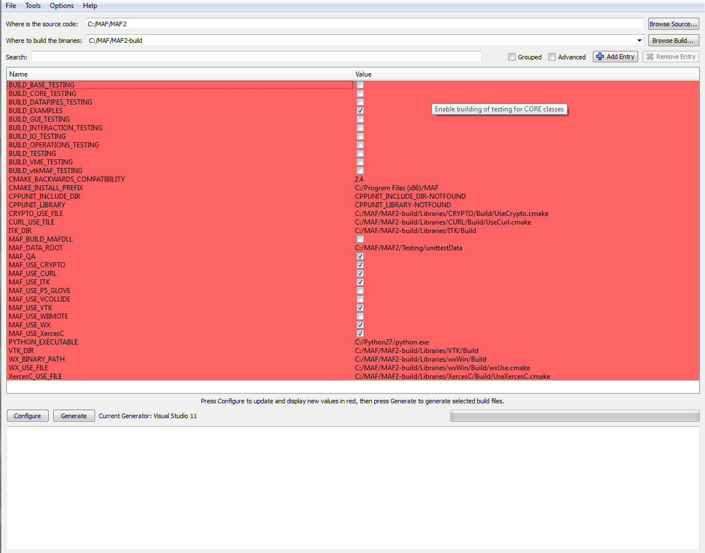
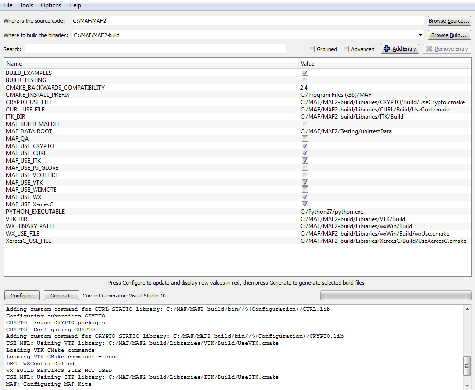
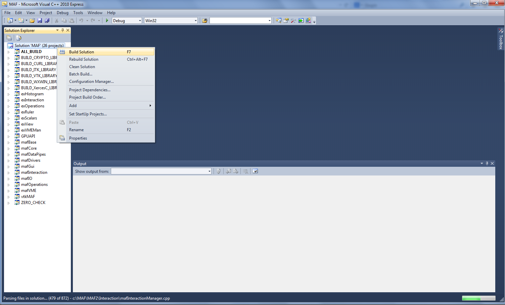

.. _MAF2:

#################################
MAF2 Compilation and Installation
#################################

.. sidebar:: Summary

    :Release: |release|
    :Date: |today|
    :Authors: **Nicolas Gruel**
    :Target: developers
    :status: draft

MAF2 installation is described on
`biomed website <https://www.biomedtown.org/biomed_town/MAF/MAF2 Floor/Reception/getting_started>`_
but the information may be out-dated or difficult to find. This
document will try to describe an up-to-date installation process on different
systems (if possible) and with different compilers (if possible).

Compilation on Windows with Visual Studio 2010
==============================================

Pre-compilation
---------------

To realize the installation on Windows XP, you need the following software:

   - Visual Studio 2010, the
     `express <http://www.microsoft.com/visualstudio/eng/downloads#d-2010-express>`_
     version will work fine. This is the compiler needed to be able to compile
     MAF2.

.. note:: 

   The
   `Service pack 3 for XP <http://www.microsoft.com/en-GB/download/details.aspx?id=24>`_
   is needed to install Microsoft Visual Studio 2010 express and above.

..

   - `Git <http://git-scm.com/downloads>`_, the control version system used
     to develop MAF2. This software will also provide some of the other tools
     needed for the installation like **gunzip**, **tar**, etc.

   - `Service pack 3 for XP <http://www.microsoft.com/en-GB/download/details.aspx?id=24>`_.
     It is needed to install Microsoft Visual Studio 2010 express and above.

   - `cmake <http://www.cmake.org/>`_ (:math:`\geq 2.8.3`)

   - `Python <http://www.python.org>`_. If there is space on the hard
     drive, the easiest way to install all the libraries needed (and more) is to
     install the package `python(x,y) <https://code.google.com/p/pythonxy/>`_
     This installs python and various of pre-compiled python software
     and libraries for scientists.

   - `doxygen <http://www.stack.nl/~dimitri/doxygen/>`_ to compile the
     documentations (optional).

   - `Graphviz <http://www.graphviz.org/>`_ also for the documentation
     (optional).

Getting the source code
-----------------------

Create and go to the directory where you will compile MAF2:: 

   > mkdir c:\MAF 
   > cd c:\MAF 
   
Obtain a copy of MAF2 from the development site `Github <http://gitub.com>`_
using the git software:: 

   > git clone git://github.com/openmaf/MAF2.git 

Compilation
-----------

Open cmake-gui and cspecify the path of the sources and where it should be compiled. Do not do it in the same directory, it seems that MAF will not appreciate
it. The source (in this example) are in *C:\\MAF\\MAF2* and the build can be in
*C:\\MAF\\MAF2-build*.

Click on the "configure" button until there are no more red lines. When it is done,
you can choose the different options to compile MAF. Choose the compiler "Visual
Studio 10" and re-do the configuration until you are happy with it and there are
no more red lines.

Open the **MAF.sln** file which will open Visual Studio 2010 and ask to compile
the solution. It should compile without any problems.

.. note::

   - This installation has been tested successfully on a virtual machine.
   - This installation worked on Microsoft Windows XP 32 bits but also 
     on Microsoft Windows 7 64 bits

.. warning::

     On Microsoft Windows 7. You can have an error like::
   
       CMake Error at
       C:/openMAF/openMAF-build/Libraries/wxWin/Build/wxBuildSettings.cmake:10
       (message): This wxWidgets263 was built by CMake 2.8.11, but this is
       CMake 2.8.11.  Please upgrade CMake to a more recent version.
   
     This error arises due to some right management problems. To solve it, 
     remove the MAF2-build directory, start cmake-gui in administrator mode by
     right-clicking on the icon and re-do the configuration. It should work 
     correctly.

.. warning::

     On Microsoft Windows 7. You may also have an error like::

         LINK : fatal error LNK1123: failure during conversion to COFF: file
         invalid or corrupt 
         [C:\Develop\Projects\Github\MAF2-build\CMakeFiles\CMakeTmp\cmTryCompileExec66905126.vcxproj]

     This is an error for .NET 4.5. If you are using .NET 4.0, this will not
     appear. The solution is to
     `download <http://www.microsoft.com/en-us/download/confirmation.aspx?id=23691#>`__
     and install VS2010 SP1.

Compilation on Windows with Visual Studio 2012
==============================================

It is possible to compile MAF2 with Microsoft Visual Studio 2012 and cmake
2.8.12.

As before, create the Visual Studion solution with Cmake (choose Visual
Studio 11). Open the solution file (MAF2.sln) and compile it.

It is possible that the compilation stop for some of the module/project results in an error
simliar to::

  3>CVTRES : fatal error CVT1100: duplicate resource.  type:MANIFEST, name:1, language:0x0409
  3>LINK : fatal error LNK1123: failure during conversion to COFF: file invalid or corrupt

If this is the case, you can continue the compilation by modifying the
properties of the module/project involved. To do this, go to::

    Project 
       -> Properties 
           -> Configuration Properties 
              -> Manifest Tool
                 ->  Input and Output
                    -> Embed Manifest -> "No"

The modules who are touched by this problem are the examples:

- exHistogram
- exOperations
- exRuler
- exScalars
- exView
- exVMEMan

.. _MAF2linux:

Compilation on Linux
====================

It is possible to achieve (with some tricks) a certain level of compilation, but
MAF2 will never work on it (MAF2 developper information).

