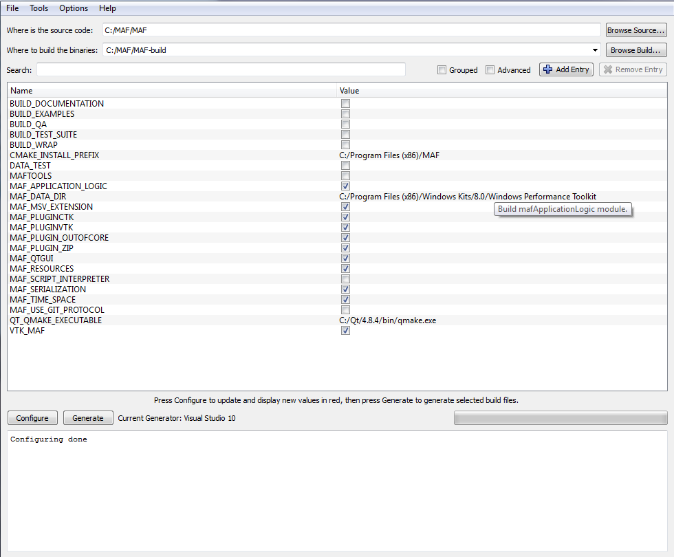
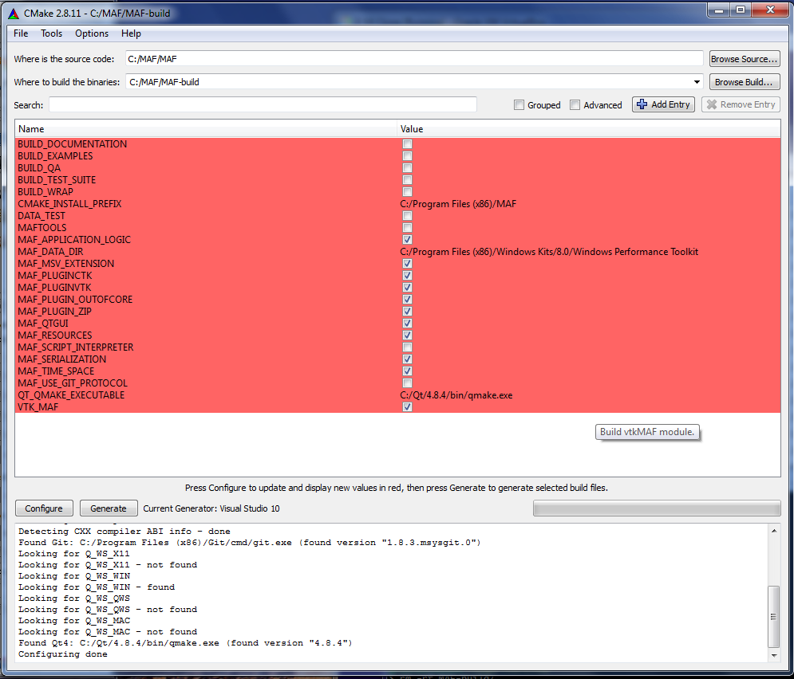
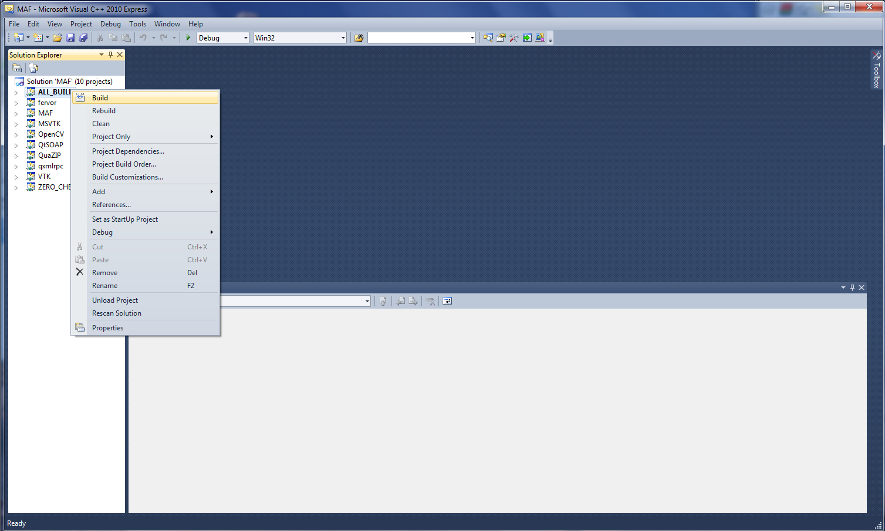

.. _MAF3:

#################################
MAF3 Compilation and Installation
#################################

.. sidebar:: Summary

    :Release: |release|
    :Date: |today|
    :Authors: **Nicolas Gruel**
    :Target: developers
    :status: draft

MAF3 installation is described on
`biomed website <https://www.biomedtown.org/biomed_town/MAF/MAF3%20Floor/Reception/getting_started>`_
but the information can be a little bit out-dated or difficult to find. This
document will try to describe an up-to-date on different system (if possible)
and with different compilers (if possible).

Compilation on Windows (32 bit)
===============================

The compilation on 32 bit Windows is pretty straightforward. The Qt4 library
used by MAF3 has a pre-compiled version provided by the project.

Pre-compilation
---------------

To do the installation on windows, you need the following software:

   - Visual Studio 2010, the
     `express <http://www.microsoft.com/visualstudio/eng/downloads#d-2010-express>`_
     version will work fine. This is the compiler needed to be able to compile
     MAF2. Any version above WILL NOT work (August 2013). !

.. note::

   The `Service pack 3 for XP <http://www.microsoft.com/en-GB/download/details.aspx?id=24>`_ 
   is needed to install Microsoft Visual Studio 2010 express and above.

..

   - `Git <http://git-scm.com/downloads>`_, the control version system used
     to develop MAF2. This software will also provide some of the other tools
     needed for the installation like **gunzip**, **tar**, etc.

   - `cmake <http://www.cmake.org/>`_ (:math:`\geq 2.8.3`)

   - `Python <http://www.python.org>`_. If there is space on the hard
     drive, the easiest way to install all the libraries needed (and more) is
     to install the package
     `python(x,y) <https://code.google.com/p/pythonxy/>`_ which installs python
     and lots of pre-compiled python software and libraries for scientific
     applications.

   - `doxygen <http://www.stack.nl/~dimitri/doxygen/>`_ to compile the
     documentations (optional).

   - `Graphviz <http://www.graphviz.org/>`_ also for the documentation
     (optional).

   - OpenSSL. One version which is working fine, even if outdated (0.9.8),
     can be found on
     `biomedtown website <https://www.biomedtown.org/biomed_town/MAF/MAF2%20Floor/download/addon/Win32OpenSSL-0_9_8d.exe/view>`_

   - `Qt <http://qt-project.org/>`_ version :math:`\geq 4.7`. Install the
     binary version, if available, for your specific compiler (here VS2010).

..   **Qt** compilation can be long and not very easy but if running on 64 bit Windows, this library should be compiled from source with openSSL
     activated (see Annex).

..  TODO

Getting the source code
-----------------------

Create and go to the directory where you will compile MAF3:: 

   > mkdir c:\MAF 
   > cd c:\MAF 
   
Obtain a copy of MAF3 from the development site `Github <http://gitub.com>`_
using the git software:: 

   > git clone git://github.com/b3c/MAF.git 

Compilation
-----------

Open cmake-gui and cspecify the directories for source code and compilation. Do
not use the same directory, as it seems that MAF will not appreciate it. The
source (in this example) are in *C:\\MAF\\MAF* and the build can be in
*C:\\MAF\\MAF-build*.

Click on the b"configure" button until there are no more red lines. When this is
done, you can choose the different options to compile MAF. Choose the compiler
Visual Studio 10 and re-do the configuration until you are happy with it and
there are no more red lines.

Open the **MAF.sln** file which will open Visual Studio 2010 and ask to compile
the solution. It should compile without any problems.

.. note::

   - This compilation has been tested successfully in a virtual machine.
   - This compilation worked with Microsoft Windows XP 32 bits but also 
     with Microsoft Windows 7 64 bits.

.. warning::

   On Windows XP, Qt installation is not complete and the PATH environment 
   variable should be modified to contain the path to the directory Qt\\bin.

   

.. warning::

   On Microsoft Windows 7. You may have an error like::
   
     CMake Error at
     C:/openMAF/openMAF-build/Libraries/wxWin/Build/wxBuildSettings.cmake:10
     (message): This wxWidgets263 was built by CMake 2.8.11, but this is CMake
     2.8.11.  Please upgrade CMake to a more recent version.
   
   This error is there because of some right management problems. To solve it, 
   remove the MAF2-build directory, start cmake-gui in administrator mode by
   right-clicking on the icon and re-do the configuration. It should work 
   correctly.

Compilation on Linux
====================

Unlike MAF2, MAF3 has been architectured to be multiplatform and it can be
compiled on GNU/Linux and probably MacOS X. The linux version is crucial, since
most of the High Performance Computer (HPC) use this operating system.

There are plenty of distributions available and the installation cannot be
described for all of them. In this document the installation will be described
for two distributions:

..  - `Linux Fedora <http://fedoraproject.org/http://fedoraproject.org/>`_
    which is pretty common and used as the base of the
    `Linux RedHat <http://www.redhat.com/>`_ distribution which is also the
    progenitor of `Scientific Linux <https://www.scientificlinux.org/>`_ or
    `Centos <http://www.centos.org/>`_. These are two very popular distributions used in
    more stable environments like HPC. Fedora will have more recent
    versions of the different libraries and software but the method should be
    more or less the same for all the variants.

..  - `Linux Debian <http://www.debian.org>`_ which is the base of the very
    popular distribution `Ubuntu <http://www.ubuntu.com/>`_ as well as the
    derivatives `Kubuntu <http://www.kubuntu.org/>`_,
    `Linux Mint <http://www.linuxmint.com/>`_ ... As for Fedora, the
    installation on Debian should be easly adapted to a variant.

  - `Scientific Linux <https://www.scientificlinux.org/>`_ version
    `6.3 <http://ftp.scientificlinux.org/linux/scientific/6.3/x86_64/iso/>`_
    because it is the one used on the HPC ICEBERG machine at Sheffield. This
    distribution does have some libraries like the essential Qt, though a
    little bit outdated and will suggest to compile it from scratch. Since on
    HPC, it is unlikely that a user can have a system manager account, the
    installation will describe how to install it on a normal user account. A
    specific paragraph will describe the installation on ICEBERG.

  - `Ubuntu Linux <http://www.ubuntu.com/download/desktop>`_ version
    `13.04 <http://releases.ubuntu.com/raring/>`_ because this version exists
    on the INSIGNEO server.

Compilation on Scientific Linux 6.3
-----------------------------------

The Scientific Linux version used on Scientific Linux 6.3 (SL 6.3) is a little
bit old and does not contain the versions needed by MAF3. In particular, the
version of Qt is 4.6 when the minimal version needed for MAF3 is 4.7.

Compilation on ICEBERG
^^^^^^^^^^^^^^^^^^^^^^

This installation is a little bit peculiar for two reasons:

  - The Scientific Linux version used on ICEBERG is a little bit old and
    does not contain the versions needed by MAF3 especially the version of Qt
    is 4.6 when the minimal version needed for MAF3 is 4.7.

  - It is not possible to install the library needed system wide (without
    specific permission and configuration from the ICEBERG system
    administrator).

Because of these two points, the installation requires some very specific steps
described here.

.. warning::

   All the operations on ICEBERG should be done on a computing node and not on
   the main system. The compilation will not work. To connect on an *insigneo*
   node::
     
     > qrsh -P insigneo -q insigneo.q

.. note::

   Most of the installation described hereafter will need the use of a bash
   terminal.

.. note::

   The compilation and installation should be done on the */data/$USER* directory.
   The *HOME* directory quota cannot sustain the Qt source and compiled files.
   Inside this directory, it would be a good idea to create a *usr* directory
   which will be used as installation directory.
   So most of the executable will be installed in the */data/$USER/usr/bin* directory,
   the header files in */data/$USER/usr/include* and */data/$USER/usr/lib* for the
   libraries.
   
Pre-installation verification
"""""""""""""""""""""""""""""

There is some software that you need to have before starting anything. It should
be already installed on ICEBERG but should be added for a fresh installation of
SL 6.3.

  - `Gnu Compiler Collection <http://gcc.gnu.org/>`_ which contains the
    compilers needed for MAF3 and the libraries associated. In a terminal, just
    write::

      > gcc --version
      > make

  This should print in the terminal the version of the compiler provided by
  ICEBERG.

  - `Git <http://git-scm.com/>`_ is the control system version used by MAF3
    development team. Use the same procedure to check the availability of the
    software::

      > git --version

.. warning::

   It seems that the git version on ICEBERG can have problems when cloning certain 
   github repositories (e.g. the MSVTK one). One solution is to compile and 
   install a newer version of git.

Definition of the PATH
""""""""""""""""""""""

It is assumed that the installation of the software and libraries will be done
in the directory **/data/$USER/usr**.

Create this directory if it doesn't exist::
   
   > mkdir /data/$USER/usr

Define the path for the executable and the library::

   > export PATH=/data/$USER/usr/bin:$PATH
   > export LD_LIBRARY_PATH=/data/$USER/usr/lib:/$LD_LIBRARY_PATH
   
For the python modules, in theory you should be able to install them on your
home directory inside the directory **$HOME/.local** but ICEBERG python
versions do not accept this. You have to define the directory where you will
install them. Since some of the python modules can also install executables, it
is better to install them in the same hierarchy as above but following python
structure. A python module should be installed in a directory similar to
*lib/site-packages/pythonX.x* where pythonX.x is the version of the python used.

On ICEBERG you have access to python2.6 and python2.7. The following process
works with python 2.6 but loading the python 2.7 version and changing it in
this tutorial should also work without any problems.

Create the python directory::

   > mkdir -p /data/$USER/usr/lib/site-packages
   
Add this directory in the PYTHONPATH variable::

   > export PYTHONPATH=/data/$USER/usr/lib/site-packages:$PYTHONPATH

Qt compilation and installation
"""""""""""""""""""""""""""""""

As mention above, Qt needs to be updated to a newer version
(:math:`4.7 \leq Qt < 5` but to do this, the gstreamer library needs to be
reinstalled in your personnal installation, since there seems to be a  problem
in locating some files needed. The re-installation of the same version and an
adjustment of the environment variable seems to be enough. The version used on
ICEBERG (August 2013) is
`gstreamer 0.10.25 <http://gstreamer.freedesktop.org/src/gstreamer/gstreamer-0.10.25.tar.bz2>`_.

To install:

   > cd /data/$USER > mkdir tmp > cd tmp > wget -c
   http://gstreamer.freedesktop.org/src/gstreamer/gstreamer-0.10.25.tar.bz2 >
   tar xvf gstreamer-0.10.25.tar.bz2 > cd gstreamer-0.10.25 > ./configure
   --prefix=/data/$USER/usr > make > make install

When gstreamer is installed, the
`gstreamer-plugin-base <http://gstreamer.freedesktop.org/src/gst-plugins-base/gst-plugins-base-0.10.25.tar.bz2>`_
should be also installed. This software also needs the library
`liboil <http://liboil.freedesktop.org/wiki/>`_ (this worked with version
0.3.14). To compile these two packages:: 

   > cd /data/$USER/tmp 
   > wget -c http://liboil.freedesktop.org/download/liboil-0.3.14.tar.gz 
   > tar xvf liboil-0.3.14.tar.gz 
   > cd liboil-0.3.14 
   > ./configure --prefix=/data/$USER/usr
   > make 
   > make install 
   > export PKG_CONFIG_PATH=/data/$USER/usr/lib/pkgconfig

The last line is there to specify the location of the pkgconfig files needed to
the configure gstreamer plugin. Its compilation and installation are done by::

   > wget -c http://gstreamer.freedesktop.org/src/gst-plugins-base/gst-plugins-base-0.10.25.tar.bz2
   > tar xvf gst-plugins-base-0.10.25.tar.bz2 
   > cd gst-plugins-base-0.10.25 
   > ./configure --prefix=/data/$USER/usr 
   > make 
   > make install

At the time of writing of this document, the available Qt4 version is
`4.8.5 <http://download.qt-project.org/official_releases/qt/4.8/4.8.5/qt-everywhere-opensource-src-4.8.5.tar.gz>`_::

   > cd /data/$USER/tmp 
   > wget -c http://download.qt-project.org/official_releases/qt/4.8/4.8.5/qt-everywhere-opensource-src-4.8.5.tar.gz
   > tar xvf qt-everywhere-opensource-src-4.8.5.tar.gz

or from the git repository::

   > cd /data/$USER/tmp 
   > git clone git://gitorious.org/qt/qt.git

When this is done, go to the directory of the Qt source::

   > cd qt-everywhere-opensource-src-4.8.5

or::

   > cd qt

Now it is time to configure and compile Qt::

   > ./configure --prefix=/data/$USER/usr

Since MAF3 is opensource you can choose the opensource licence, so answer 'o'
and accept the licence 'yes'. This step can be avoided by creating a file with
the answers::

   > echo -e 'yes' > qt-compile.txt
   > ./configure -opensource -openssl --prefix=/data/$USER/usr < qt-compile.txt

if there are no error messages (there shouldn't be), compile using as many cores
as you want, with the option *-j* (here there are 8 cores used) and install Qt.
Since the compilation will be long, you should create a script and start a job
e.g.::

   > echo '#!/bin/bash

   > #$ -m bea 
   > #$ -j y

   > make -j 8 
   > make install' > qt-compile.sge
   >
   > qsub qt-compile.sge
   
If the compilation does not work as a job, you can try to start the compilation
manually. Because of the **fair-use** algorithm, it is possible that you will
have to restart the compilation.

When this is done, there are two small steps to do before compiling MAF3. MAF3
provides a python wrapper and to compile this part, two libraries not provided
by the system should be installed **lxml** and **jinja2**. The default python
version on ICEBERG is 2.6 and so does not have the --user option which should
install the python package in ~/.local/lib/python2.6/site-packages/. The
*--prefix* should be used instead. This implies the definition of a PYTHONPATH
in the *~/.bashrc* file::

   > mkdir -p /home/gruel/.local/lib/python2.6/site-packages/
   > echo "export PYTHONPATH=$HOME/.local/lib/python2.6/site-packages:$PYTHONPATH" >> ~/.bashrc
   > export PYTHONPATH=$HOME/.local/lib/python2.6/site-packages:$PYTHONPATH"
   > easy_install --prefix=$USER/.local lxml==2.3
   > easy_install --prefix=$USER/.local jinja2
   
The other solution is to use the python2.7 module and *pip* instead of
*easy_install*::

   > module load apps/python/2.7
   > pip install lxml==2.3 --user
   > pip install jinja2 --user

Install cmake on iceberg::
   
   > cd /data/$USER/tmp
   > wget -c http://www.cmake.org/files/v2.8/cmake-2.8.12.1.tar.gz
   > tar xvf cmake-2.8.12.1.tar.gz
   > cd cmake-2.8.12.1
   > ./configure --prefix=/data/$USER/usr
   > make
   > make install

Download INSIGNEO source of MAF3 for git repository::

   > mkdir -p /data/$USER/MAF3
   > cd /data/$USER/MAF3
   > git clone git://github.com/openmaf/MAF3.git
   > mkdir -p /data/$USER/MAF3/MAF-build
   > cd /data/$USER/MAF3/MAF-build
   > cmake ../MAF -DBUILD_DOCUMENTATION=YES -DBUILD_EXAMPLES=YES \ 
   > -DBUILD_TEST_SUITE=YES -DDATA_TEST=YES -DBUILD_WRAP=YES \
   > -Dvalgrind_ENABLE=ON -DMAFTOOLS=ON -DBUILD_QA=ON
   > make
